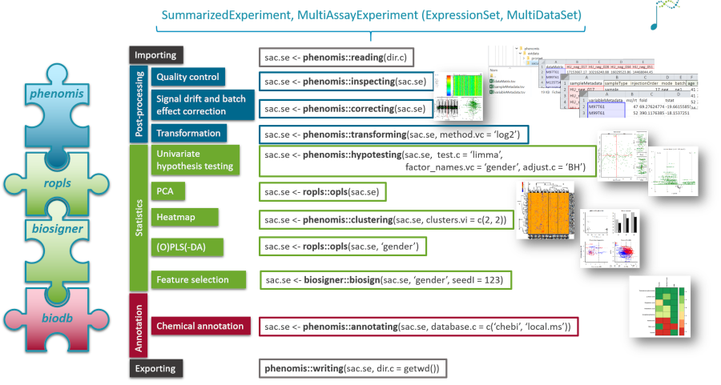
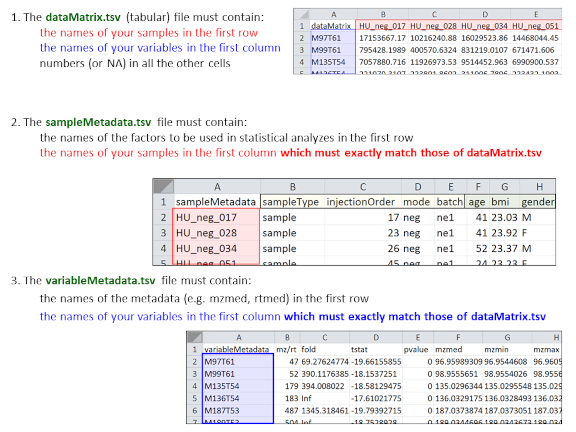

# **phenomis**: An R package for post-processing and univariate analysis

## Description

This package provides methods to perform the statistical analysis of
phenomics datasets (e.g. in proteomics and metabolomics). These methods
include the reading of datasets (as 3 table *dataMatrix*,
*sampleMetadata* and *variableMetadata* .tsv files) into a
**`SummarizedExperiment`** or **`MultiAssayExperiment`** object
(**`reading`**), quality control (**`inspecting`**) and transformation
(**`transforming`**) of the dataMatrix, reduction of chemical redundancy
(**`reducing`**), and univariate hypothesis testing (**`hypotesting`**).
Multivariate analysis and feature selection can be further performed
with the
[**ropls**](http://bioconductor.org/packages/release/bioc/html/ropls.html)
and
[**biosigner**](http://bioconductor.org/packages/release/bioc/html/biosigner.html)
packages, respectively. Finally, features can be annotated based on
their m/z (and rt) values against public or local databases
(**`annotating`**; based on the
[**biodb**](https://github.com/pkrog/biodb) package). See the
[**phenomis vignette**](vignettes/phenomis.Rmd) for a detailed example
of the analysis of a metabolomics dataset.

*Note that the `ExpressionSet` and `MultiDataSet` formats are deprecated
since version 0.4.0 and are therefore no longer maintained.*

## Contributors

Natacha Lenuzza, Alyssa Imbert, Pierrick Roger and Etienne A. Thevenot.

## Maintainer

Etienne A. Thévenot
([etienne.thevenot\@cea.fr](mailto:etienne.thevenot@cea.fr))

Data Sciences team (Odiscé)

Medicines and Healthcare Technologies Department CEA, INRAE, Université
Paris Saclay, MetaboHUB 91191 Gif-sur-Yvette Cedex, France

Web: <https://odisce.github.io/>

## Methods

## Formats

### 3 tabular file format used for import/export

Input (i.e. preprocessed) data consists of a 'samples times variables'
matrix of intensities (**datMatrix** numeric matrix), in addition to
sample and variable metadata (**sampleMetadata** and
**variableMetadata** data frames). Theses 3 tables can be conveniently
imported to/exported from R as tabular files:

### `SummarizedExperiment`

The following methods are available:

| Methods                                         | Description                                         | Returned class                    |
|-------------------------------------------------|-----------------------------------------------------|-----------------------------------|
| **Constructors**                                |                                                     |                                   |
| **`SummarizedExperiment`**                      | Create a SummarizedExperiment object                | `SummarizedExperiment`            |
| **`makeSummarizedExperimentFromExpressionSet`** |                                                     | `SummarizedExperiment`            |
| **Accessors**                                   |                                                     |                                   |
| **`assayNames`**                                | Get or set the names of assay() elements            | `character`                       |
| **`assay`**                                     | Get or set the ith (default first) assay element    | `matrix`                          |
| **`assays`**                                    | Get the list of experimental data numeric matrices  | `SimpleList`                      |
| **`rowData`**                                   | Get or set the row data (features)                  | `DataFrame`                       |
| **`colData`**                                   | Get or set the column data (samples)                | `DataFrame`                       |
| **`metadata`**                                  | Get or set the experiment data                      | `list`                            |
| **`dim`**                                       | Get the dimensions (features of interest x samples) | `integer`                         |
| **`dimnames`**                                  | Get or set the dimension names                      | `list` of length 2 character/NULL |
| **`rownames`**                                  | Get the feature names                               | `character`                       |
| **`colnames`**                                  | Get the sample names                                | `character`                       |
| **`as(, "SummarizedExperiment")`**              | Convert an ExpressionSet to a SummarizedExperiment  | `SummarizedExperiment`            |

### `MultiAssayExperiment`

The following methods are available ([Ramos et al.,
2016](https://doi.org/10.1158/0008-5472.CAN-17-0344)):

| Methods                    | Description                                                          | Returned class           |
|----------------------------|----------------------------------------------------------------------|--------------------------|
| **Constructors**           |                                                                      |                          |
| **`MultiAssayExperiment`** | Create a MultiAssayExperiment object                                 | `MultiAssayExperiment`   |
| **`ExperimentList`**       | Create an ExperimentList from a List or list                         | `ExperimentList`         |
| **Accessors**              |                                                                      |                          |
| **`colData`**              | Get or set data that describe the patients/biological units          | `DataFrame`              |
| **`experiments`**          | Get or set the list of experimental data objects as original classes | `experimentList`         |
| **`assays`**               | Get the list of experimental data numeric matrices                   | `SimpleList`             |
| **`assay`**                | Get the first experimental data numeric matrix                       | `matrix`, matrix-like    |
| **`sampleMap`**            | Get or set the map relating observations to subjects                 | `DataFrame`              |
| **`metadata`**             | Get or set additional data descriptions                              | `list`                   |
| **`rownames`**             | Get row names for all experiments                                    | `CharacterList`          |
| **`colnames`**             | Get column names for all experiments                                 | `CharacterList`          |
| **Subsetting**             |                                                                      |                          |
| **`mae[i, j, k]`**         | Get rows, columns, and/or experiments                                | `MultiAssayExperiment`   |
| **`mae[i, ,]`**            | i: GRanges, character, integer, logical, List, list                  | `MultiAssayExperiment`   |
| **`mae[,j,]`**             | j: character, integer, logical, List, list                           | `MultiAssayExperiment`   |
| **`mae[,,k]`**             | k: character, integer, logical                                       | `MultiAssayExperiment`   |
| **`mae[[i]]`**             | Get or set object of arbitrary class from experiments                | (Varies)                 |
| **`mae[[i]]`**             | Character, integer, logical                                          |                          |
| **`mae$column`**           | Get or set colData column                                            | `vector` (varies)        |
| **Management**             |                                                                      |                          |
| **`complete.cases`**       | Identify subjects with complete data in all experiments              | `vector` (logical)       |
| **`duplicated`**           | Identify subjects with replicate observations per experiment         | `list` of `LogicalLists` |
| **`mergeReplicates`**      | Merge replicate observations within each experiment                  | `MultiAssayExperiment`   |
| **`intersectRows`**        | Return features that are present for all experiments                 | `MultiAssayExperiment`   |
| **`intersectColumns`**     | Return subjects with data available for all experiments              | `MultiAssayExperiment`   |
| **`prepMultiAssay`**       | Troubleshoot common problems when constructing main class            | `list`                   |
| **Reshaping**              |                                                                      |                          |
| **`longFormat`**           | Return a long and tidy DataFrame with optional colData columns       | `DataFrame`              |
| **`wideFormat`**           | Create a wide DataFrame, one row per subject                         | `DataFrame`              |
| **Combining**              |                                                                      |                          |
| **`c`**                    | Concatenate an experiment                                            | `MultiAssayExperiment`   |
| **Viewing**                |                                                                      |                          |
| **`upsetSamples`**         | Generalized Venn Diagram analog for sample membership                | `upset`                  |

### **ExpressionSet** and **MultiDataSet** classes

A legacy representation of ID-based datasets, supported for convenience
and supplanted by `SummarizedExperiment` and `MultiAssayExperiment`.

| Biobase methods        | Description                                                     |
|------------------------|-----------------------------------------------------------------|
| **exprs(eset)**        | 'variable times samples' numeric matrix - dataMatrix            |
| **pData(eset)**        | sample metadata data frame - sampleMetadata                     |
| **fData(eset)**        | variable metadata data frame - variableMetadata                 |
| **sampleNames(eset)**  | sample names                                                    |
| **featureNames(eset)** | variable names                                                  |
| **dims(eset)**         | 2-element numeric vector of 'Features' and 'Samples' dimensions |
| **varLabels(eset)**    | Column names of the sampleMetadata, pData(eset)                 |
| **fvarLabels(eset)**   | Column names of the variableMetadata, fData(eset)               |

### **MultiDataSet** class for multiple datasets

| MultiDataSet methods | Description                                      | Returned class       |
|----------------------|--------------------------------------------------|----------------------|
| **as.list(mae)**     | Get the list of data matrices                    | List                 |
| **mds2mae**          | Convert a MultiDataSet to a MultiAssayExperiment | MultiAssayExperiment |

## Installation

The package can be installed from github with
`devtools::install_github("odisce/phenomis")`.

## Tutorial

See the [**phenomis vignette**](vignettes/phenomis.Rmd) for a detailed
example of the analysis of a metabolomics dataset.

## Please cite

-   Imbert, A., Rompais, M., Selloum, M., Castelli, F., Mouton-Barbosa,
    E., Brandolini-Bunlon, M., Chu-Van, E., Joly, C., Hirschler, A.,
    Roger, P., Burger, T., Leblanc, S., Sorg, T., Ouzia, S.,
    Vandenbrouck, Y., Médigue, C., Junot, C., Ferro, M., Pujos-Guillot,
    E., de Peredo, A. G., Fenaille, F., Carapito, C., Herault, Y., &
    Thévenot, E. A. (2021). ProMetIS, deep phenotyping of mouse models
    by combined proteomics and metabolomics analysis. *Scientific Data*,
    8(1).
    [doi:10.1038/s41597-021-01095-3](https://doi.org/10.1038/s41597-021-01095-3)

-   Thévenot, E.A., Roux, A., Xu, Y., Ezan, E., and Junot, C. (2015).
    Analysis of the human adult urinary metabolome variations with age,
    body mass index and gender by implementing a comprehensive workflow
    for univariate and OPLS statistical analyses. *Journal of Proteome
    Research* 14, 3322--3335.
    [doi:10.1021/acs.jproteome.5b00354](https://doi.org/10.1021/acs.jproteome.5b00354)
